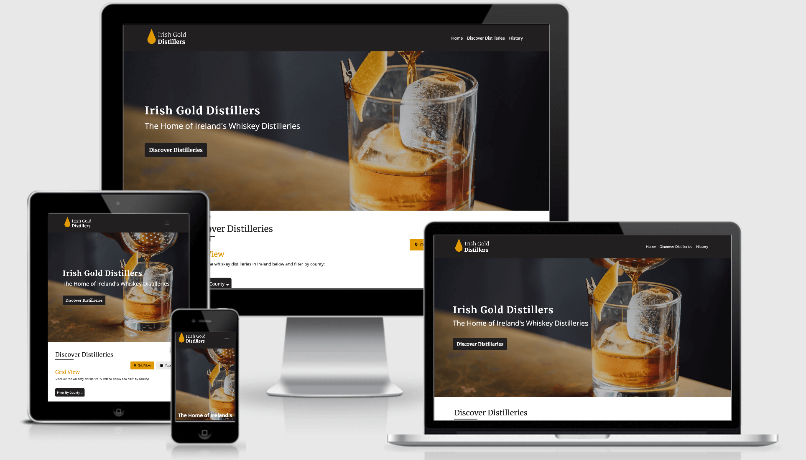
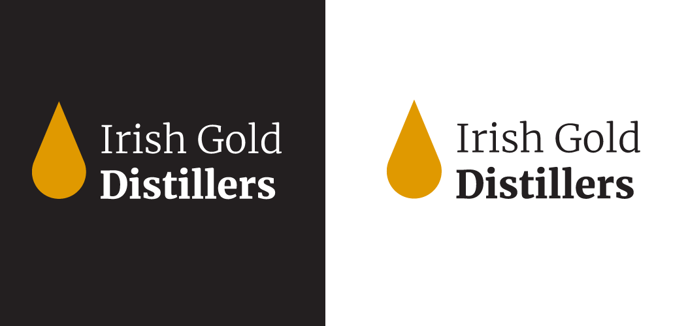
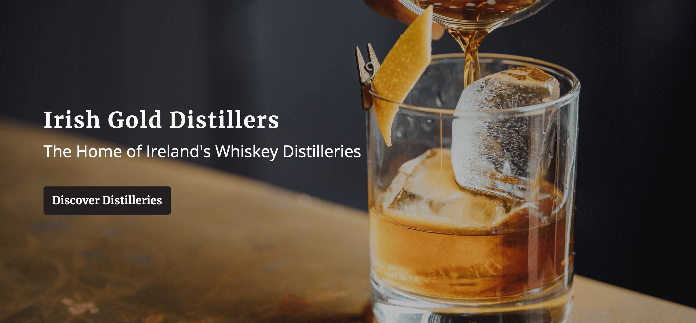
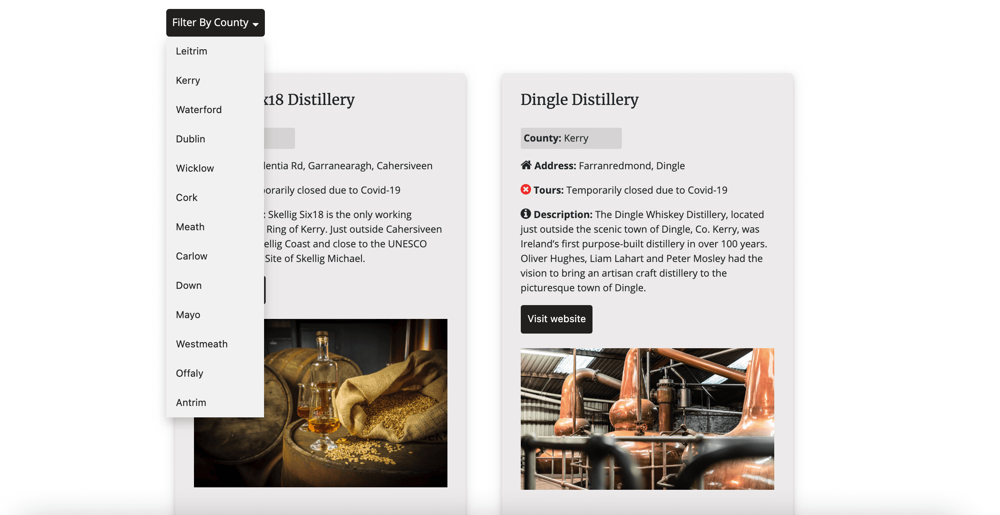
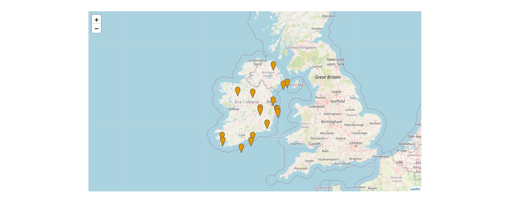
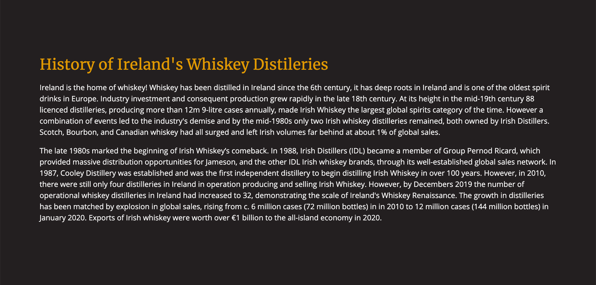
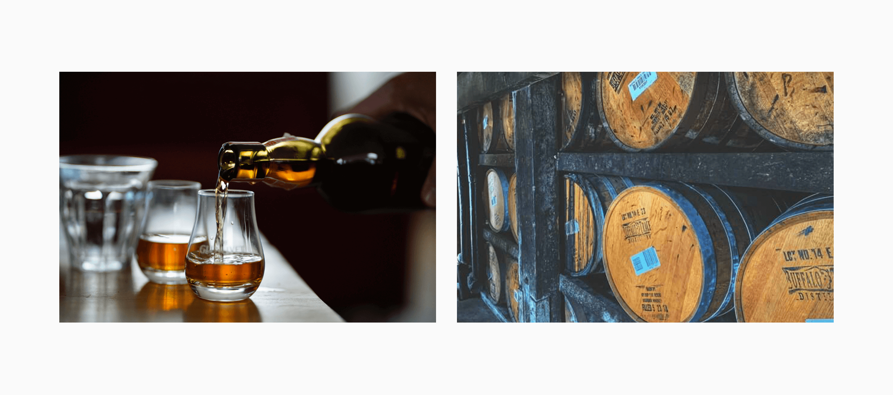
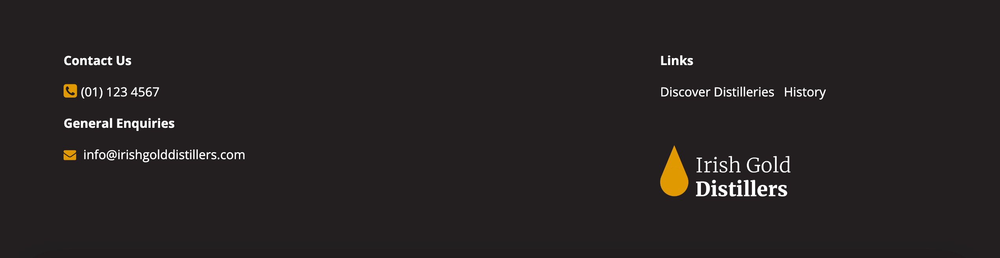

# Irish Gold Distillers Website

## Table of Contents
* [Purpose](#purpose)
* [User Experience Design](#user-experience-design)
    * [User stories](#user-stories)
        * [First-time Visitor Goals](#first-time-visitor-goals)
        * [Returning Visitor Goals](#returning-visitor-goals)
        * [Frequent Visitor Goals](#frequent-visitor-goals)
    * [Wireframes](#wireframes)
    * [Typography](#typography)
    * [Colour scheme](#colour-scheme)
    * [Imagery](#imagery)
        * [Logo and Favicon](#logo-and-favicon)
        * [Stock Images](#stock-images)
        * [Distillery Images](#distillery-images)
* [Features](#features)
    * [Existing Features](#existing-features)
    * [Features Left to Implement](#features-left-to-implement)
* [Technologies Used](#technologies-used)
* Testing
    * Automated Testing
        * Responsiveness
        * W3C Validator Tools
        * Problems Encountered
    * Manual Testing
        * User Story Testing
        * Devices
        * Browsers
        * CI Peer Code Review
        * Issues Encountered
* Deployment
    * GitHub Project Creation
    * GitHub Pages
    * Run Locally
* [Credits](#credits)
    * [Code](#code)
    * [Media](#media)
    * [Acknowledgements](#acknowledgements)

## Purpose

According to [The Irish Whiskey Association](https://www.drinksireland.ie/Sectors/DI/DI.nsf/vPagesWhiskey/Industry_in_Ireland~the-irish-whiskey-industry!OpenDocument), whiskey distilleries in Ireland have grown from just four in 2010 to 32 in 2019, demonstrating the scale of Ireland's Whiskey Renaissance. The purpose of the Irish Gold Distillers website is to satisfy the demand for, and interest in, Irish whiskey products by providing the end user with a fully responsive and interactive website showcasing the whiskey distilleries across the country. 

I was inspired to create this website when I was travelling around the west coast of Ireland during the summer of 2020 and I struggled to find a website which housed and clearly displayed a list of all the whiskey distilleries in Ireland and their location. At that moment, I noted this as a great opportunity to fill the gap.

Please note, this website was created for the Code Institute’s Milestone Project 2 as part of their Diploma in Full Stack Software Development. It was developed using the knowledge gained from the HTML, CSS, User Centric Design, JavaScript and Interactive Front-end Development modules.

Please see the [Irish Gold Distillers](https://jessicajuliet.github.io/irish-gold-distillers/) live website.

## User Experience Design

### User stories

#### First-time Visitor Goals

* As a first-time visitor, I want to navigate through the website easily on both mobile and desktop devices
* As a first-time visitor, I want to be able to quickly identify that the website provides information on whiskey distilleries in Ireland 
* As a first-time visitor, I want to see a visually pleasing website with attractive whiskey imagery

#### Returning Visitor Goals

* As a returning visitor, I want to explore the whiskey distilleries in Ireland and filter by county
* As a returning visitor, I want to easily find the location of whiskey distilleries on an interactive map
* As a returning visitor, I want to read about and see photos of the whiskey distilleries in Ireland

#### Frequent Visitor Goals
* As a frequent visitor, I want to read about the history of Ireland's whiskey distilleries
* As a frequent visitor, I want to check to see if the distillery is running tours during the COVID-19 pandemic

### Wireframes

The Irish Gold Distiller's site was designed as single page website so the user can easily access its key functionality - showcasing whiskey distilleries in Ireland - with minimal clicks. 

Wireframes were created for mobile, tablet and desktop using balsamiq. Please see the wireframes below for the varying devices:

* [Mobile Grid View](https://github.com/JessicaJuliet/irish-gold-distillers/blob/1b44ad115d37410ba98e85bcfdb99d100b33c9df/wireframes/mobile.png)
* [Mobile Map View](https://github.com/JessicaJuliet/irish-gold-distillers/blob/1b44ad115d37410ba98e85bcfdb99d100b33c9df/wireframes/mobile-map-view.png)
* [Tablet Grid View](https://github.com/JessicaJuliet/irish-gold-distillers/blob/1b44ad115d37410ba98e85bcfdb99d100b33c9df/wireframes/tablet.png)
* [Tablet Map View](https://github.com/JessicaJuliet/irish-gold-distillers/blob/1b44ad115d37410ba98e85bcfdb99d100b33c9df/wireframes/tablet-map-view.png)
* [Desktop Grid View](https://github.com/JessicaJuliet/irish-gold-distillers/blob/1b44ad115d37410ba98e85bcfdb99d100b33c9df/wireframes/desktop.png)
* [Desktop Map View](https://github.com/JessicaJuliet/irish-gold-distillers/blob/1b44ad115d37410ba98e85bcfdb99d100b33c9df/wireframes/desktop-map-view.png)

### Typography

The fonts chosen for this website were [Merriweather](https://fonts.google.com/specimen/Merriweather) and [Open Sans](https://fonts.google.com/specimen/Open+Sans). 

Merriweather is a serif font which was designed specifically for screens and is pleasant to read on them. I got inspiration to use this font from looking at whiskey websites, as well as whiskey bottle labelling, to explore the type of fonts they used. I deicded to use Merriweather for key headings on the website.

Open Sans was sourced as a popular pairing with Merriweather from Google Fonts. Open Sans is a sans serif font which provides a nice contrast with Merriweather and is optimised for web and mobile interfaces. I used Open Sans for minor body text on the website.

I sampled both of these fonts prior to using them on the site using Google Fonts 'preview' tool.

### Colour Scheme

The colour scheme chosen for this website was black and gold. Gold is used to represent the colour of whiskey and black evokes a feeling of quality and professionalism on the website. It also creates a great contrast with gold providing a good visual experience for the user. Finally, the gold colour was sourced from the [Irish Distiller's](https://www.irishdistillers.ie/) website. 

* **Black**  Hex value #231f20
* **Gold** - Hex value #e09900

 

### Imagery

#### Logo and Favicon

The logo consists of a gold droplet to represent whiskey and the text ‘Irish Gold Distillers’. The font used is Merriweather Light for ‘Irish Gold’ and Merriweather Black for ‘Distillers’. In addition, the favicon is a gold droplet of whiskey. 

The gold and black used in the logo matches that on the website and two versions were created for dark and bright backgrounds. Furthermore, the favicon and logo were designed using Adobe Illustrator and saved in the appropriate file formats to ensure a reduced file size. 

### Stock Images

The website uses strong and impactful whiskey imagery to capture the users interest from the start. The stock images used on the website were sourced from [Unsplash](https://unsplash.com) and referenced within the code.

### Distillery Images

The images for each of the distilleries were taken from [Irish Whiskey 360](https://irishwhiskey360.com/discover-irelands-whiskey-distilleries/), as well as their descriptive content. 

## Features

The Irish Gold Distillers website is an interactive single page website divided into seven key sections. Each section is described in greater detail below, outlining their features and how they meet the user stories identified at the beginning of the website build.  

### Existing Features

#### Section 1 - Navbar

The navbar is fully responsive and collapses down into a hamburger menu on smaller devices. It provides a short list of links to the key sections on the website. 

The navbar was not fixed to the top of the page as the webpage is short and requires minimal scrolling to reach its key functionality. Instead greater focus is given to providing the user with as much screen display as possible for its interactive elements. 

Links were provided in the footer to ensure the user could easily access key sections of website without scrolling back to the top to access the navbar. 

> As a first-time visitor, I want to navigate through the website easily on both mobile and desktop devices

#### Section 2 - Hero Image & CTA

The hero image and headings are a key component of the website as they allow the user to quickly establish the purpose of the site. The CTA directs the user directly to its interactive search functionality.

On mobile, the H1 and CTA are removed from the hero image to not obstruct the image, however the H2 remains to ensure the website's purpose is clear.

> As a first-time visitor, I want to be able to quickly identify that the website provides information on whiskey distilleries in Ireland

> As a first-time visitor, I want to see a visually pleasing website with attractive whiskey imagery

#### Section 3 - Grid View 

The Grid View section of the website allows the user to filter distilleries by county and see a grid list of results. The results include the distillery's name, address, description, image and whether they're currently running tours. It also has a link to their website so the user can find out more information.

The county was intentionally highlighted above the address so users can quickly see that their filter selection is correct. Furthermore, icons were used to break up content and let users decipher information easily.

> As a returning visitor, I want to explore the whiskey distilleries in Ireland and filter by county

> As a returning visitor, I want to read about and see photos of the whiskey distilleries in Ireland

> As a frequent visitor, I want to check to see if the distillery is running tours during the COVID-19 pandemic

#### Section 4 - Map View

In addition to the Grid View above, users can also see a list of distilleries displayed on an interactive map. The map used is from a free open-source JavaScript library called Leaflet.

When they hover over the marker, or click on mobile, more information is displayed about the distillery. The marker was customised to match the gold droplet in the logo.

> As a returning visitor, I want to easily find the location of whiskey distilleries on an interactive map

#### Section 5 - History

For website users looking for delve a little deeper into Ireland's whiskey distilleries, this section provides them with a short but insightful description of whiskey distilleries in Ireland. 

> As a frequent visitor, I want to read about the history of Ireland's whiskey distilleries

#### Section 6 - Images

The Images Section provides the user with rich imagery of whiskey and whiskey casks. This makes the website more visually appealing and provides a nice break between the history text and footer. 

> As a first-time visitor, I want to see a visually pleasing website with attractive whiskey imagery

#### Section 7 - Footer

The Footer highlights the website's contact information, links and logo. These were included in the Footer as this is the location they're most commonly expected by a website user. The links allow the user to go back to the section of the page they wish without having to scroll back to the top. 

### Features Left to Implement

* A submission form for distillery owners to implement their details if they're not already included on the website and wish to be listed
* Include a full comprehensive list of distilleries in Ireland and update this as and when more come about

## Technologies Used

* [GitHub](https://github.com/)
    
    * GitHub is the hosting site used to store the source code for the Website

* [Git](https://git-scm.com/)

    * Git was used as the version control software to add, commit and push code to the GitHub repository

* [Gitpod](https://gitpod.io/workspaces/)

    * Gitpod was used as the development environment to write my code

* HTML

    * HTML was the main language used to create this website

* CSS

    * Custom CSS was used to add bespoke design

* JavaScript

    * JavaScript was used to create interactive elements on the website

* [Bootstrap](https://getbootstrap.com/)

    * Bootstrap was used throughout the website for the grid layout, navbar and buttons

* [balsamiq](https://balsamiq.com/wireframes/)

    * balsamiq was used to create low-fidelity wireframes of the website

* [Adobe Illustrator](https://www.adobe.com/ie/products/illustrator.html)

    * Illustrator was used to create the logo and favicon for the website

* [Google Fonts](https://fonts.google.com/)

    * Google Fonts was used to find, sample and import fonts for the logo and website

* [TinyPNG](https://tinypng.com/)

    * TinyPNG was used to compress all images before uploading them to Gitpod to ensure a good website speed

* [Google Chrome Developer Tools](https://developers.google.com/web/tools/chrome-devtools)

    * Chrome Developer Tools was used to test the site's responsiveness on different devices and to debug the code

* [Font Awesome](https://fontawesome.com/)

    * Sourced icons on website from Font Awesome

* [Responsinator](https://www.responsinator.com/)

    * Responsinator was used to test the website's responsiveness across different screen sizes

* [Am I Responsive](http://ami.responsivedesign.is/#)

    * Am I Responsive was used to test the website's responsiveness across different screen sizes

* [W3C Markup Validation Service](https://validator.w3.org/)

    * The W3C Markup validator was used regularly to check for any errors in the HTML on the site

* [W3C CSS Validation Service](https://jigsaw.w3.org/css-validator/)

    * The W3C CSS validator was used regularly to check for any errors in the CSS on the site

* [JSHint](https://jshint.com/)

    * JSHint was regularly used to detect errors and potential problems in the JavaScript code

## Credits

### Code 
1. Sourced code for navbar from Bootstrap - https://getbootstrap.com/docs/4.0/components/navbar/
2. Sourced code for icons from Font Awesome - https://fontawesome.bootstrapcheatsheets.com/
3. Sourced code for Leaflet.js map from Leaflet - https://leafletjs.com/examples/quick-start/ 
4. Obtained content for History section from Drinks Ireland - https://www.drinksireland.ie/Sectors/DI/DI.nsf/vPagesWhiskey/Industry_in_Ireland~the-irish-whiskey-industry!OpenDocument
5. Code for tab buttons was taken from W3Schools - https://www.w3schools.com/howto/howto_js_tabs.asp 
6. Hover dropdown menu sourced from W3Schools - https://www.w3schools.com/howto/howto_css_dropdown.asp 

All other minor guiding resoures were referenced within the code. 

### Media
* The Irish Gold Distiller's logo and favicon were created by me using Adobe Illustrator
* The icons used on the site were sourced from Font Awesome
* The images across the website were obtained from Unsplash and Irish Whiskey 360 

### Acknowledgements
*  Thank you to the tutors and my mentor at the Code Institute for helping me to tackle all the challenges which JavaScript threw my way