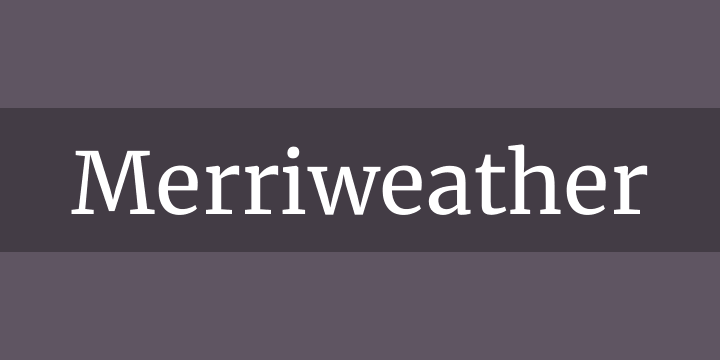
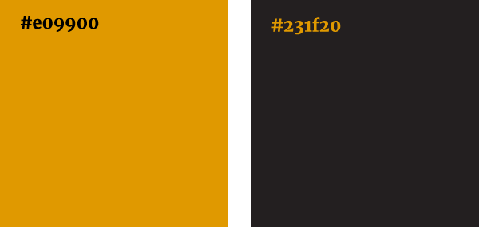
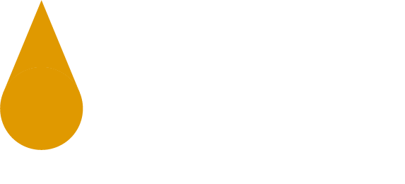

# Irish Gold Distillers Website

## Table of Contents
* [Purpose](#purpose)
* [User Experience Design](#user-experience-design)
    * [User stories](#user-stories)
        * [First-time Visitor Goals](#first-time-visitor-goals)
        * [Returning Visitor Goals](#returning-visitor-goals)
        * [Frequent Visitor Goals](#frequent-visitor-goals)
* [Design](#design)
    * [Wireframes](#wireframes)
    * [Typography](#typography)
    * [Colour scheme](#colour-scheme)
    * [Imagery](#imagery)
        * [Logo](#logo)
        * [Stock Images](#stock-images)
        * [Distillery Imager](#distillery-images)
* Features
    * Features
    * Existing Features
    * Features Left to Implement
* [Technologies Used](#technologies-used)
* Testing
    * Automated Testing
        * Responsiveness
        * W3C Validator Tools
        * Problems Encountered
    * Manual Testing
        * User Story Testing
        * Devices
        * Browsers
        * CI Peer Code Review
        * Issues Encountered
* Deployment
    * GitHub Project Creation
    * GitHub Pages
    * Run Locally
* Credits
    * Code and Guiding Resources
    * Media
    * Acknowledgements

## Purpose

According to [The Irish Whiskey Association](https://www.drinksireland.ie/Sectors/DI/DI.nsf/vPagesWhiskey/Industry_in_Ireland~the-irish-whiskey-industry!OpenDocument), whiskey distilleries in Ireland have grown from just four in 2010 to 32 in 2019 demonstrating the scale of Ireland's Whiskey Renaissance. The purpose of the Irish Gold Distillers website is to satisfy the demand for Irish whiskey products by providing the end user with a fully responsive and interactive website showcasing the whiskey distilleries across the country. 

Furthermore, I was inspired to create this website when I was travelling around the west coast of Ireland during the summer of 2020 and I struggled to find a site which clearly displayed all of the whiskey distilleries in the country. I noted this as a good opportunity to fill the gap!

Please note, this website was created for the Code Institute’s Milestone Project 2 as part of their Diploma in Full Stack Software Development. It was developed using the knowledge gained from the HTML, CSS, User Centric Design, JavaScript and Interactive Front-end Development modules.

Please see the [Irish Gold Distillers](https://jessicajuliet.github.io/irish-gold-distillers/) live website.

## User Experience Design

### User stories

#### First-time Visitor Goals

* As a first-time visitor, I want to navigate through the website easily on a mobile and desktop device
* As a first-time visitor, I want to be able to quickly identify that the website houses all the whiskey distilleries in Ireland 
* As a first-time visitor, I want to see a visually pleasing website with attractive whiskey imagery which represent quality products

#### Returning Visitor Goals

* As a returning visitor, I want to explore the whiskey distilleries across Ireland, read their description and see associated imagery so I know what to expect before  visiting
* As a returning visitor, I want to easily find the location of Ireland's whiskey distilleries on an interactive map

#### Frequent Visitor Goals
* As a frequent visitor, I want to read about the history of Ireland's whiskey distilleries

### Design

#### Wireframes

Irish Gold Distillers was designed as single page website so the user can easily access its key functionality (showcasing whiskey distilleries in Ireland) with minimal clicks to obtain said information. In addition, as the webpage is short the navbar is not fixed to the top, but links are provided in the footer to ensure minimal scrolling. 

Wireframes were created for mobile, tablet and desktop using balsamiq. Please see the wireframes below for the varying devices:

* [Mobile](https://github.com/JessicaJuliet/irish-gold-distillers/blob/1b44ad115d37410ba98e85bcfdb99d100b33c9df/wireframes/mobile.png)
* [Mobile Map View](https://github.com/JessicaJuliet/irish-gold-distillers/blob/1b44ad115d37410ba98e85bcfdb99d100b33c9df/wireframes/mobile-map-view.png)
* [Tablet](https://github.com/JessicaJuliet/irish-gold-distillers/blob/1b44ad115d37410ba98e85bcfdb99d100b33c9df/wireframes/tablet.png)
* [Tablet Map View](https://github.com/JessicaJuliet/irish-gold-distillers/blob/1b44ad115d37410ba98e85bcfdb99d100b33c9df/wireframes/tablet-map-view.png)
* [Desktop](https://github.com/JessicaJuliet/irish-gold-distillers/blob/1b44ad115d37410ba98e85bcfdb99d100b33c9df/wireframes/desktop.png)
* [Desktop Map View](https://github.com/JessicaJuliet/irish-gold-distillers/blob/1b44ad115d37410ba98e85bcfdb99d100b33c9df/wireframes/desktop-map-view.png)

#### Typography

The font chosen for this website is [Merriweather](https://fonts.google.com/specimen/Merriweather). Merriweather is a serif font was designed specifically for screens and is pleasant to read. 

I got inspiration to use this font from looking at other whiskey website and whiskey bottle packaging to see the type of fonts which they used. I sampled different fonts using Google Fonts and inputted sample text to preview the style beforehand.

 - *image source, [Font Squirel](https://www.fontsquirrel.com/fonts/merriweather)*

#### Colour Scheme

The colour theme chosen for this website is black and gold. The gold colour was sourced from the [Irish Distiller's](https://www.irishdistillers.ie/) website.

Gold is used to represent the colour of whiskey and black evokes a feeling of quality and professionalism on the website. It also creates great contrast with gold. 

* **Black** - Hex value #231f20
* **Gold** - Hex value #e09900

 

#### Imagery

#### Logo

The logo consists of a gold droplet to represent whiskey and the text ‘Irish Gold Distillers’. The font used is Merriweather Light for ‘Irish Gold’ and Merriweather Black for ‘Distillers’.  The favicon is a gold droplet of whiskey. 

The gold used in both the favicon and logo has a hex value of #e09900. Inspiration for this gold was sourced from [Pernod Ricard’s Irish Distillers](https://www.irishdistillers.ie/) website. Furthermore, the logo and favicon were created in Adobe Illustrator and saved in the appropriate file formats to ensure a reduced file size. 

#### Stock Images

The website uses strong and impactful whiskey imagery to capture the users interest from the start. The stock images used on the website were sourced from [Unsplash](https://unsplash.com) and referenced within the code.

#### Distillery Images

The images for each of the distilleries were taken from [Irish Whiskey 360](https://irishwhiskey360.com/discover-irelands-whiskey-distilleries/), as well as their descriptive content. 

## Technologies Used

* GitHub
    
    *   GitHub is the hosting site used to store the source code for the Website

* Git

    * Git was used as the version control software to add, commit and push code to the GitHub repository

* Gitpod

    * Gitpod was used as the development environment to write my code

* balsamiq

    * balsamiq was used to create low-fidelity wireframes of the website

* Adobe Illustrator

    * Illustrator was used to create the logo and favicon for the website

* Google Fonts

Google Fonts was used to find, sample and import fonts for the logo and website
